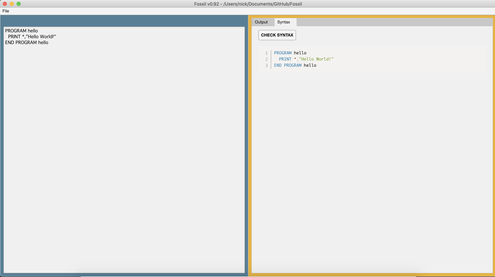

# Fossil

#### Current version: 0.9.2
 Fossil is a Fortran IDE designed in MATLAB App Designer by someone eager to learn the antiquated computer language but in an easy and accessible way. More documentation can be found in the `docs` folder, including [`changelog`](docs/CHANGELOG.md), [`future`](docs/FUTURE.md), and [`layout`](docs/LAYOUT.md).

  
 
 
